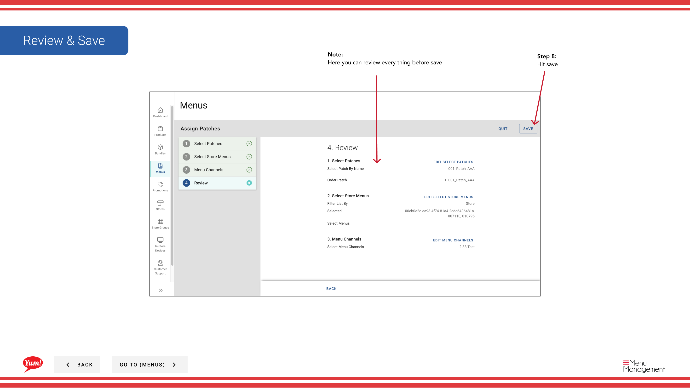

# a パッチ (Replace Existing List)を割り当てる

## このガイドで扱う内容

このガイドでは、Byte Commerce Admin Portal でa パッチ (Replace Existing List)を割り当てる手順を説明します。

## 手順

**ステップ 1:** まず、こちらをクリックして Menu 画面に移動します。
**ステップ 2:** on the patches tab をクリックします。

**ステップ 3:** create new paatch をクリックします。

**ステップ 4:** the flow that best applies to what you want to do をクリックします。

**ステップ 5:** patch by name を選択します。

**ステップ 6:** stores を選択します。

**ステップ 7:** the menu channel を選択します。

**ステップ 8:** Hit save

## 注意事項

:::note
You can search stores by specific store group as well by clicking this dropdown and selecting a store group.
:::

:::note
Here you can review every thing before save
:::

## 追加情報

- メニュー - a パッチ  (Replace Existing パッチ List)を割り当てる
- パッチ Button Groupを割り当てる

---

*[管理ポータルガイド](/docs/admin-portal-guide) の一部 · セクション: メニュー*