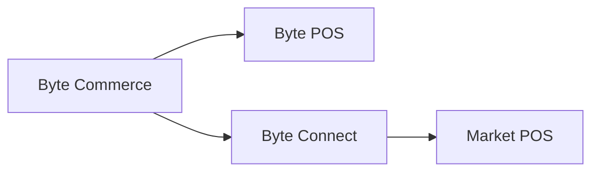

# Byte Connect

> Byte Connect は、市場が Byte POS を使っていない場合に、Byte Commerce とその市場 POS をつなぐブリッジです。

---

## 基本ルール

市場が **Byte POS** を使っていない場合、**Byte Connect は Byte Commerce オンボーディングの一部として必ず導入する必要があります。**

Byte Commerce は **Byte POS** と直接通信する前提で構築されています。非 Byte POS 市場では、Byte Connect が中間に入り、その市場 POS への接続経路を担います。

---

## Byte Connect の役割

Byte Connect は、非 Byte POS 環境との統合ブリッジとして機能し、Byte Commerce の注文と注文更新を市場 POS と送受信できるようにします。

つまり、運用上の理解は次の通りです。

- 市場が Byte POS を使う場合: **Byte Commerce -> Byte POS**
- 市場が Byte POS を使わない場合: **Byte Commerce -> Byte Connect -> POS**

避けるべき最大の誤解は、「Byte Commerce はどの市場 POS とも標準で直接連携できる」という前提です。そうではありません。Byte POS がない場合、Byte Connect が必須ブリッジです。

---

## オンボーディング上の意味

非 Byte POS 市場にとって、Byte Connect は任意オプションではありません。Byte Commerce オンボーディングの標準構成の一部です。

市場セットアップ、ローンチ範囲、スケジュール、統合責任を計画するチームは、市場 POS が Byte POS でない限り、Byte Connect を標準依存として扱う必要があります。

---

## このページを参照する場面

次の説明が必要なときは、このページを参照してください。

- Byte Commerce がすべての POS と直接連携しない理由
- 非 Byte POS 市場で Byte Connect が必要な理由
- 非 Byte POS 市場で Byte Commerce がどのように店舗システムへ到達するか

---

:::tip 関連リンク
- [機能境界](/docs/byte-capabilities/enablement/capability-boundaries)
- [Commerce Backend Reference](/docs/byte-capabilities/reference/commerce-backend)
- [プラットフォーム全体像](/docs/byte-capabilities/mental-model)
:::
